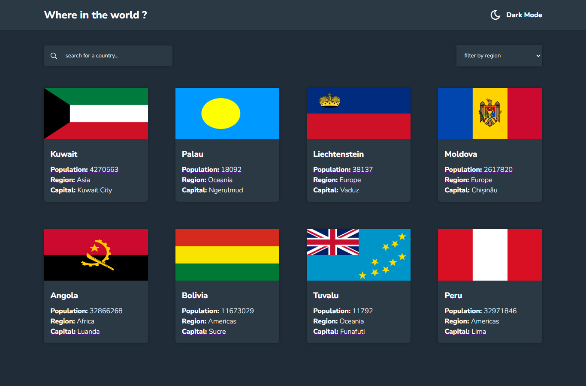

# Frontend Mentor - REST Countries API with color theme switcher solution

This is a solution to the [REST Countries API with color theme switcher challenge on Frontend Mentor](https://www.frontendmentor.io/solutions/flexbox-css-grid-responsiveness-css-layouts-L0hJ-Waycf). Frontend Mentor challenges help you improve your coding skills by building realistic projects, so make sure you check out the website for cool awesome projects too

## Table of contents

- [Overview](#overview)
  - [The challenge](#the-challenge)
  - [Screenshot](#screenshot)
  - [Links](#links)
- [My process](#my-process)
  - [Built with](#built-with)
  - [What I learned](#what-i-learned)
  - [Continued development](#continued-development)
  - [Useful resources](#useful-resources)
- [Author](#author)
- [Acknowledgments](#acknowledgments)

## Overview

This is quite an advance projects that helped me in solving some challenges and problems that I have never come accross before while building other projects. It leveled up my skills and it's a pretty great project that will get you busy in solving real problems. Nevertheless, it was tough at first but i actually get it done anyway with some couple of googling and that was it...

### The challenge

Users should be able to:

- See all countries from the API on the homepage
- Search for a country using an `input` field
- Filter countries by region
- Click on a country to see more detailed information on a separate page
- Click through to the border countries on the detail page
- Toggle the color scheme between light and dark mode _(optional)_

### Screenshot

Here is the screenshort of the solution that i provided below, it is almost the same width the one provided by Frontend mentor and right now I feel a great sense of accomplishment !



### Links

- Solution URL: [Add solution URL here](https://www.frontendmentor.io/solutions/flexbox-css-grid-responsiveness-css-layouts-L0hJ-Waycf)
- Live Site URL: [Add live site URL here](https://rest-countries-web-app-project.netlify.app/)

## My process

I thought this was one of the random projects that I used to build easily and it wasn't the case. It only took me 3 days to build but I faced some kind of challenges I had to think over and over again, do some refactor and change the rendering of some component to another component and so on, but finally, I actually got the job done.

The project wasn't that difficult because I am already familiar with fetching data and other stuff, but the fact of passing one data into another component and then another components again made it a big issue to wrap my head aroung it.

I know there's a better way to write the code that i have just written, but this one is not that bad too. and I am looking forward to get better in what i do

### Built with

- Semantic HTML5 markup
- CSS custom properties
- Flexbox
- CSS Grid
- Mobile-first workflow
- [React](https://reactjs.org/) - JS library

### What I learned

I learnt quite a few things like, filter data with select tag, and that is becuase I have never implemented it in any of my projects so it was very great applying the feature in this porject.

I also learnt how to get the unique values from objects example:

To see how you can add code snippets, see below:

```js
const regions = [
  { id: 1, name: 'Asia' },
  { id: 2, name: 'Oceania' },
  { id: 3, name: 'Americas' },
  { id: 4, name: 'Antartic' },
  { id: 5, name: 'Africa' },
  { id: 6, name: 'Americas' },
  { id: 7, name: 'Europe' },
  { id: 8, name: 'Europe' },
]

const uniqueValues = new Set(regions.map(region, index) => region.name)
console.log(uniqueValues) // return object of names, it will ignore the item with the samae name

// turn the object into an array
const uniqueValues = [new Set(regions.map(region, index) => region.name)]
// this will return an array of names

```


### Continued development

I would like to focus more on how to effectively pass data from one components to another without any difficuties. I think this alone sounds like a great thing that i definitely need to wrap my head around for now


## Author

- Website - [Add your name here](https://www.your-site.com)
- Frontend Mentor - [@Almarex-Web-Dev](https://www.frontendmentor.io/profile/Almarex-Web-Dev)
- Twitter - [@almarexwebdev](https://www.twitter.com/yourusername)


## Acknowledgments

I did everything on my own, But i wouldn't mind asking for help if i had to!!
